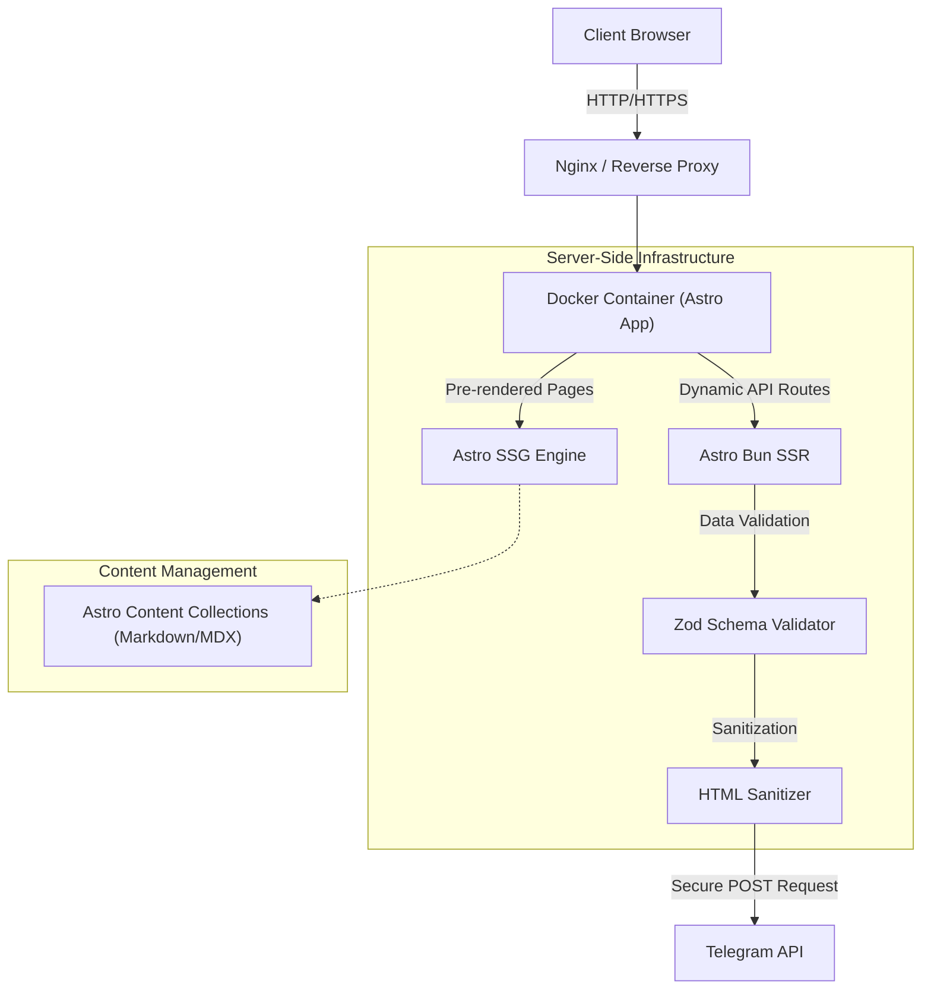
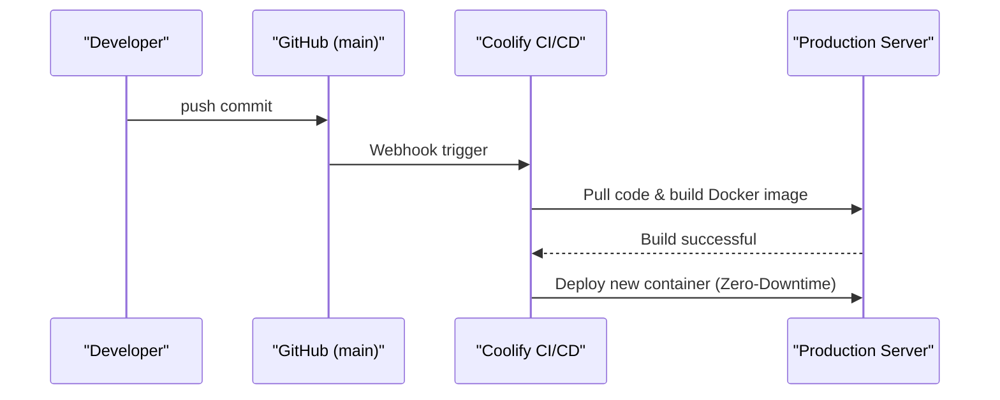

# Technical Specifications

[🏠 Home](../README.md) | [🇷🇺 Russian Version](./TECHNICAL.ru.md)

---

> [!IMPORTANT]
> **Architectural Paradigm**: This project emphasizes extreme decoupling, built-in type-safety via Astro Content Collections, and stateless integrations. This completely removes the need for a database or backend administration panel, dramatically shrinking the attack surface while maintaining full interactivity and content dynamism.

## 🧩 Architectural Topology

The data flow is strictly unilateral, securing environment variables and executing sensitive operations purely on the server side.



## 🔐 Security Architecture

1. **XSS Protection**: All user inputs in forms are automatically sanitized via server-side logic (`sanitize-html`) running on the Astro Bun backend to prevent script injection.
2. **Environment Masking**: Internal keys (`BOT_TOKEN`, `CHAT_ID`) are rigorously masked. The client is completely unaware of these values.
3. **Container Isolation**: The multi-stage Dockerfile utilizes Bun Alpine, enforcing a root-less execution protocol at runtime for operational security.

## 🚀 CLI Commands

To replicate this environment locally, follow the standards below:

```bash
# Package manager standard
bun install

# Start development server
bun run dev

# Build for production
bun run build

# Run TypeScript/Astro type checks
bun run check
```

## 🚢 CI/CD Deployment Flow



---

<br />
<p align="center">
  <a href="https://avpdev.com/en/"><b>Alexios Odos</b></a>
  &nbsp;|&nbsp;
  <a href="https://avpdev.com/ru/"><b>Aliaksei Patskevich</b></a>
  <br />
  <sub>
    <b>Software Engineer</b> • Code, Design & AI
    <br />
    TypeScript &bull; Node.js &bull; Python &bull; Next.js
    <br />
    <a href="https://github.com/AVP-Dev">GitHub</a> &bull; <a href="https://t.me/AVP_Dev">Telegram</a>
  </sub>
</p>

<p align="center">
  
  
  
</p>
