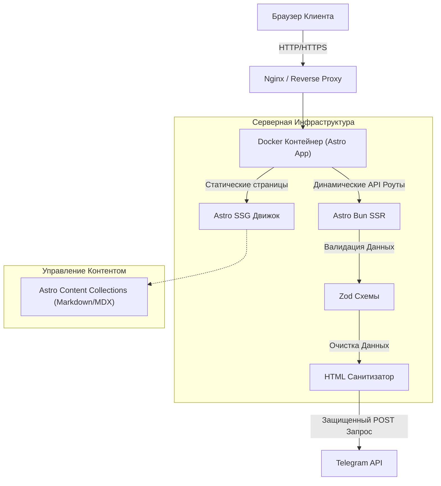
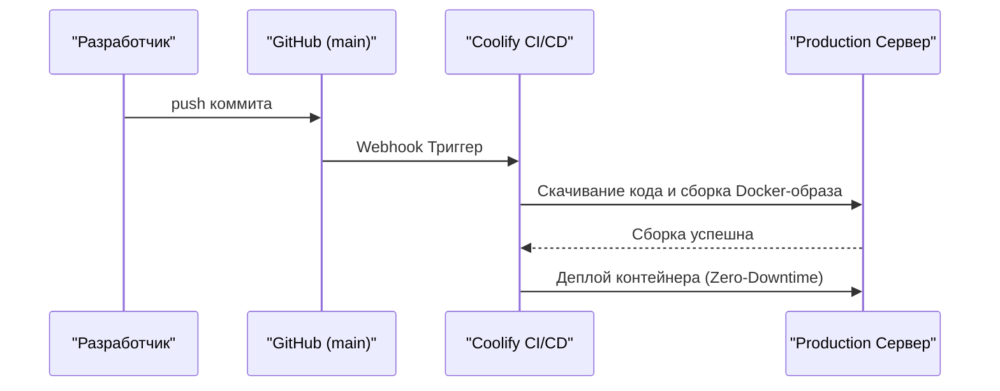

# Техническая спецификация

[🏠 Главная](../README.ru.md) | [🇺🇸 English Version](./TECHNICAL.md)

---

> [!IMPORTANT]
> **Архитектурная парадигма**: Проект акцентирует внимание на максимальной развязке (decoupling), встроенной типизации через Astro Content Collections и stateless-интеграциях. Это позволяет полностью отказаться от базы данных и админки, многократно снижая векторы атак, сохраняя при этом гибкость управления контентом и интерактивность.

## 🧩 Архитектурная топология

Поток данных строго однонаправленный. Все чувствительные операции и системные переменные хранятся и исполняются исключительно на стороне сервера.



## 🔐 Архитектура безопасности

1. **Защита от XSS**: Все пользовательские вводы из форм очищаются через `sanitize-html` на бэкенде Astro (Bun) для исключения инъекций скриптов.
2. **Маскирование Окружения**: Секретные ключи (`BOT_TOKEN`, `CHAT_ID`) никогда не попадают в клиентский код и используются только на сервере.
3. **Изоляция Контейнеров**: Docker-сборка базируется на Bun Alpine с жестко заданным запуском процессов от имени пользователя без root-прав (non-root execution).

## 🚀 CLI Команды

Для локального запуска и проверки репозитория используйте следующие команды:

```bash
# Инициализация зависимостей
bun install

# Запуск dev-сервера
bun run dev

# Сборка production-версии
bun run build

# Строгая проверка типов (TypeScript / Astro)
bun run check
```

## 🚢 Флоу CI/CD Деплоя

Автоматизация процесса происходит по следующему сценарию:



---

<br />
<p align="center">
  <a href="https://avpdev.com/en/"><b>Alexios Odos</b></a>
  &nbsp;|&nbsp;
  <a href="https://avpdev.com/ru/"><b>Aliaksei Patskevich</b></a>
  <br />
  <sub>
    <b>Software Engineer</b> • Code, Design & AI
    <br />
    <a href="https://github.com/AVP-Dev">GitHub</a> &bull; <a href="https://t.me/AVP_Dev">Telegram</a>
  </sub>
</p>

<p align="center">
  
  
  
  
  <br />
  
  
  
</p>

