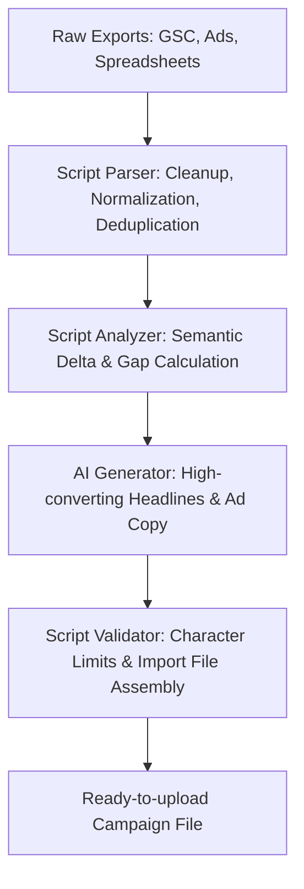

There is a widespread illusion across the tech industry today: the belief that any problem — from complex strategy to mundane spreadsheet sorting — can be solved with a single prompt to an LLM. We are frequently told that classic deterministic programming is dead and that "prompt engineering" is the universal cure.

In practice, blindly trusting generative AI with raw data often leads to disaster: reports filled with fabricated numbers, lost records in client data dumps, and hours spent trying to "convince" a model to stop hallucinating.

In this article, we'll examine why AI is not a magic silver bullet, where deterministic code vastly outperforms neural networks, and how to build a robust hybrid pipeline based on real-world engineering experience.

---

### In this article:
- [Probability vs Determinism: The Core Difference](#math-vs-probability)
- [Where Neural Networks Fail at Routine Tasks](#where-ai-fails)
- [Real Case: Processing Hundreds of Thousands of Rows from Search Console & Ads](#real-case)
- [Where AI Truly Shines: Semantic Superpowers](#ai-superpowers)
- [The Sandwich Architecture: A Formula for Resilient Automation](#hybrid-sandwich)
- [Conclusion](#conclusion)

---

## Probability vs Determinism: The Core Difference {#math-vs-probability}

To understand where each tool belongs, we have to look at how they work under the hood:

* **Deterministic Scripts (Python, TypeScript, SQL, Bash)** operate in an exact world. When you write a filtering or sorting algorithm, it executes in milliseconds with a 100% reproducible outcome. A script never "gets tired," never silently drops row #4,582, and never rounds a financial figure just because it reads more naturally.
* **Large Language Models (LLMs)** operate in a probabilistic world. Models do not calculate or verify facts mathematically; they predict the most likely next token. For an LLM, "2 + 2 = 4" is simply a high-probability string completion.

When you delegate raw data manipulation to an LLM, you are replacing a Swiss watch with a plausible-guess generator.

---

## Where Neural Networks Fail at Routine Tasks {#where-ai-fails}

Attempting to push raw, repetitive data tasks into an AI chat interface usually triggers three major issues:

### 1. Hallucinations and Silent Data Corruption
The most dangerous trait of LLMs is the confidence with which they make mistakes. A model might parse 95% of your dataset flawlessly, but quietly invent figures, merge mismatched fields, or omit crucial rows across the remaining 5%. Spotting such subtle errors manually across a 50,000-row export is nearly impossible.

### 2. The Fragility of Output Formatting
We have all been there: you explicitly prompt the model for valid, raw JSON without commentary, yet it adds markdown wrappers, breaks quote escaping, or alters object key casings. In automated production systems, this instability breaks downstream parsers.

### 3. Latency and Iteration Overhead
A clean script cleans, dedupes, and normalizes typos across hundreds of thousands of lines in seconds. Feeding massive text dumps into an LLM forces you into minutes of generation latency, followed by the tedious necessity of verifying every line against hallucinations.

---

## Real Case: Processing Hundreds of Thousands of Rows from Search Console & Ads {#real-case}

Here is a practical case study from my own engineering work where relying purely on AI would have been a catastrophic bottleneck, whereas a hybrid workflow delivered extraordinary results.

### The Objective:
Automate the data ingestion pipeline for massive export datasets (GSC, Google Ads, spreadsheets) and campaign preparation:
1. **Ingest and Parse Big Data:** Process datasets with dozens of attributes (search queries, misspellings, impressions, CTR, landing pages) from Google Search Console, ad platforms, and raw spreadsheets.
2. **Clean and Normalize:** Instantly filter hundreds of thousands of repetitive search strings, cluster typo variations, eliminate noise, and structure into a uniform format.
3. **Analyze Differences:** Cross-reference the processed data against active campaigns and competitor intelligence.
4. **Isolate the Delta:** Pinpoint exact semantic gaps — discovering high-intent queries that are missing from existing keyword lists.
5. **Generate and Export:** Leverage AI to craft tailored, high-converting ad copy and headlines for the missing clusters, then use a final script to package everything into a valid file ready for instant upload into the ad cabinet.

### How the Scripts Delivered:
Deterministic scripts handled the heavy lifting:
* Instantly parsed hundreds of thousands of repetitive search strings, misspelled queries, and messy attributes.
* Applied strict string distance algorithms to cluster queries and calculate frequencies with zero loss of precision.
* Calculated the exact mathematical difference between current campaigns and newly discovered queries, outputting a clean, targeted list of gaps.

Attempting to feed this raw dump directly into an LLM would have resulted in truncated data, fabricated impression numbers, and endless prompt correction cycles.

---

## Where AI Truly Shines: Semantic Superpowers {#ai-superpowers}

Once the script isolated the clean, concise "delta," the AI engine stepped in to do what it does best:

1. **Contextual Headline and Copy Generation.** The model analyzed targeted keyword clusters to draft engaging, high-converting ad headlines tailored to user search intent.
2. **Tone-of-Voice Adaptation.** Effortlessly producing variations for different target audiences (e.g., enterprise B2B vs direct B2C).
3. **Synthesis and Strategic Takeaways.** Providing crisp summaries on why specific search clusters were trending and suggesting how to refine campaign messaging.

---

## The Sandwich Architecture: A Formula for Resilient Automation {#hybrid-sandwich}

Modern automation works best when designed as an architectural "sandwich" where AI is safely bounded inside deterministic code:

1. **Base Layer (Code / Parsers):** Ingestion, data typing, filtering, mathematical operations, and noise removal.
2. **Filling (AI / LLMs):** Creative, contextual, and semantic synthesis applied exclusively to clean, compact data packets.
3. **Top Layer (Code / Schemas):** Strict schema validation (e.g., via Zod or character limit guards like Google Ads' 30-char headline rules) and final structured file generation.

With this structure, the model is physically prevented from breaking database schemas or producing invalid export formats, giving you the best of both worlds.

---

## Conclusion {#conclusion}

AI is an extraordinary cognitive amplifier, but an unreliable calculator and a clumsy bulk parser.

* If your task revolves around **numbers, strict schemas, bulk filtering, calculating diffs, or deduplication** — write a script. It is faster, cheaper, and 100% deterministic.
* If your task requires **understanding nuanced intent, synthesizing unstructured text, creative copywriting, or strategic takeaways** — plug in AI.

Don't use a microscope as a hammer. Build hybrid systems where rock-solid code provides the skeleton, and AI breathes life and meaning into the results.

---

*Related reading: [AI: Why It's Your Most Capable and Dangerous Apprentice](/en/blog/ai-capable-dangerous-student) | [AI-Friendly Code Architecture](/en/blog/ai-friendly-code-architecture)*
