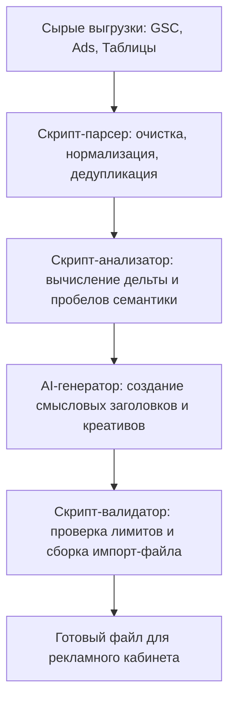

Сейчас в индустрии царит опасная эйфория: кажется, будто любую задачу — от сложного анализа до банальной сортировки таблиц — можно решить одним промптом в нейросеть. Нас убеждают, что классическое программирование устарело, а будущее за «промпт-инжинирингом» для всего подряд.

Однако на практике слепая вера в магию искусственного интеллекта регулярно приводит к катастрофам: отчёты с выдуманными цифрами, потерянные строки в клиентских выгрузках и часы, потраченные на попытки «уговорить» модель не фантазировать.

В этой статье разберём, почему AI — это не универсальная серебряная пуля, где детерминированный код на голову превосходит нейросети, и как на реальном опыте построить гибридный пайплайн, объединяющий точность алгоритмов и гибкость LLM.

---

### В этой статье:
- [Вероятность против Детерминизма: фундаментальная разница](#math-vs-probability)
- [Где нейросети опасны и бесполезны](#where-ai-fails)
- [Кейс: Обработка сотен тысяч строк из Google Search Console и Ads](#case)
- [Где AI действительно незаменим: суперсилы LLM](#ai-superpowers)
- [Сэндвич-пайплайн: формула надежной автоматизации](#hybrid-sandwich)
- [Итог](#conclusion)

---

## Вероятность против Детерминизма: фундаментальная разница {#math-vs-probability}

Чтобы понимать границы применимости инструментов, нужно помнить, как они устроены изнутри:

* **Классический скрипт (Python, TypeScript, SQL, Bash)** — это **детерминированный мир**. Если вы написали функцию сортировки или фильтрации, она выполнится за миллисекунды и даст ровно 100% гарантированный, воспроизводимый результат. Скрипт не может «устать», потерять строку номер 4582 или округлить число просто потому, что «так красивее звучит».
* **Языковая модель (LLM)** — это **вероятностный мир**. Модель не считает и не проверяет факты в математическом смысле — она предсказывает наиболее вероятный следующий токен. Для неё «2 + 2 = 4» и «2 + 2 = 5» — это распределение вероятностей.

Когда вы поручаете модели рутинную работу с данными, вы заменяете швейцарские часы на генератор правдоподобных предположений.

---

## Где нейросети опасны и бесполезны {#where-ai-fails}

Попытка загрузить «сырую» рутину в чат с нейросетью обычно оборачивается тремя проблемами:

### 1. Галлюцинации и «тихие» ошибки
Самое опасное в LLM — уверенность, с которой она ошибается. Модель может обработать 95% данных корректно, а на оставшихся 5% выдумать значения, склеить несовместимые поля или просто выкинуть часть строк, посчитав их незначительными. Найти такую ошибку в таблице на 50 000 строк вручную практически невозможно.

### 2. Бесконечное «выбивание» правильного формата
Сколько раз вы сталкивались с ситуацией: просишь модель выдать чистый JSON без комментариев, а она всё равно добавляет пояснения, ломает экранирование кавычек или меняет регистр ключей? В продакшн-системах такая нестабильность ломает весь пайплайн.

### 3. Медлительность и ожидание
Парсинг, очистка опечаток и поиск пересечений скриптом занимают считанные секунды. Запрос к нейросети с огромным массивом текста заставляет вас минутами ждать генерации ответа, в котором с высокой вероятностью придётся перепроверять каждую строчку.

---

## Кейс: Обработка сотен тысяч строк из Google Search Console и Ads {#case}

Покажу наглядный пример из собственной практики, где попытка сделать всё через AI была бы провалом, а правильное разделение труда дало потрясающий результат.

### Задача:
Автоматизировать конвейер обработки больших выгрузок данных (GSC, Google Ads, Директ, таблицы) и генерации рекламных кампаний:
1. **Сбор и разбор выгрузок:** Обработать массивы данных с десятками параметров и атрибутов — поисковые фразы, опечатки, показы, CTR, посадочные страницы — из Google Search Console, рекламных кабинетов и таблиц.
2. **Очистка и нормализация:** Мгновенно профильтровать сотни тысяч строк однообразного текста, сгруппировать слова с опечатками, отсечь нерелевантный мусор и привести всё к единой структуре.
3. **Анализ различий:** Сопоставить обработанные данные с уже используемыми кампаниями и активностями конкурентов.
4. **Выявление дельты:** Точно определить пробелы — какие целевые поисковые интенты упущены и какие именно ключевые фразы нужно добавить.
5. **Генерация и экспорт:** С помощью AI сформировать релевантные объявления и креативы под найденные пробелы, а затем скриптом упаковать всё в валидный файл, готовый к мгновенной загрузке в рекламный кабинет.

### Как отработали скрипты:
Скрипты и парсеры взяли на себя «тяжелую артиллерию»:
* Моментально переварили сотни тысяч строк с повторяющимися словами, опечатками и вариациями запросов.
* По жестким алгоритмам нормализовали формулировки, рассчитали частотности и сгруппировали кластеры.
* С математической точностью сравнили текущую семантику с новой выгрузкой и выдали чистую разницу — список конкретных узлов, требующих запуска новых объявлений.

Попытка скормить эти массивы напрямую в нейросеть привела бы к потере данных, фантазиям о статистике кликов и бесконечным циклам исправлений.

---

## Где AI действительно незаменим: суперсилы LLM {#ai-superpowers}

После того как скрипт очистил данные и оставил только точечную «дельту», на сцену выходит искусственный интеллект. Здесь он работает в своей идеальной среде:

1. **Генерация смысловых связок и заголовков.** Модель анализирует конкретный кластер поисковых запросов и формулирует цепляющие, живые тексты объявлений, бьющие в потребность клиента.
2. **Адаптация tone-of-voice.** Создание нескольких вариантов под разные сегменты аудитории (строгий b2b, динамичный b2c).
3. **Суммаризация и сноски.** Быстрое формирование смысловых выводов: почему именно эти кластеры сейчас показывают рост и какие акценты в оффере стоит усилить.

---

## Сэндвич-пайплайн: формула надежной автоматизации {#hybrid-sandwich}

Лучшая современная автоматизация — это архитектурный «сэндвич», где AI изолирован внутри детерминированных границ:

1. **Нижний слой (Код / Парсеры):** Сбор данных, валидация типов, фильтрация, математические расчеты, удаление шума.
2. **Начинка (AI / LLM):** Творческая, смысловая и семантическая обработка уже подготовленной, компактной порции данных.
3. **Верхний слой (Код / Схемы):** Жесткая проверка ответа модели (например, через Zod-схемы или валидацию лимитов длины заголовков Google Ads: 30 знаков) и генерация итогового файла для импорта.

При такой схеме модель физически не способна сломать структуру базы или выдать невалидный файл, а вы получаете максимум от обеих технологий.

---

## Итог {#conclusion}

AI — это мощнейший когнитивный усилитель, но плохой калькулятор и ненадежный парсер.

* Если задача сводится к **числам, жестким структурам, фильтрации, поиску различий или дедупликации** — пишите скрипт. Это быстрее, надежнее и на 100% предсказуемо.
* Если задача требует **понимания контекста, синтеза смыслов, креативного рерайтинга или формулирования выводов** — подключайте AI.

Не пытайтесь забивать гвозди микроскопом. Стройте гибридные системы, где строгий код держит каркас, а нейросеть наполняет его смыслом.

---

*Читайте также: [AI: Почему это твой самый способный и самый опасный ученик](/ru/blog/ai-capable-dangerous-student) | [Архитектура кода под ИИ](/ru/blog/ai-friendly-code-architecture)*
