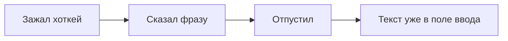

Мы говорим со скоростью примерно 130–160 слов в минуту, а печатаем — в лучшем случае 60–70. Разница более чем в два раза.

В последние годы работа за компьютером сильно сместилась в сторону текста: мы пишем подробные контекстные промпты для AI-ассистентов в Cursor или Claude, описываем архитектурные решения, ставим задачи и постоянно общаемся в рабочих чатах. Казалось бы, надиктовывать такие объемы голосом логичнее и быстрее.

Но любой разработчик, который пробовал стандартный голосовой ввод, быстро бросает эту затею по двум причинам:

1. **Он не понимает контекст разработки.** Обычный STT путает регистры, не знает `camelCase`, коверкает технические термины и превращает названия библиотек в случайные бытовые слова.
2. **Лишние действия.** Большинство сторонних утилит требуют открыть окно, нажать кнопку записи, подождать, нажать «Скопировать», переключиться обратно в редактор и вставить текст. Если для простой операции нужно сделать пять лишних движений мышью, привычка не приживается.

Чтобы решить обе эти проблемы, я написал **[Nyx Vox](https://github.com/AVP-Dev/nyx-vox)**. Это легковесная утилита на Rust и Tauri, которой я пользуюсь каждый день.

---

### В этой статье:
- [Как устроен процесс](#how-it-works)
- [Редактирование без искажения смысла](#verbatim)
- [Где это экономит время каждый день](#daily-use)
- [Приватность и локальный режим](#privacy)
- [Версия для Windows и Open Source](#open-source)

---

## Как устроен процесс {#how-it-works}

Главное требование к инструменту было простым: процесс ввода должен быть незаметным и не требовать мыши.

Механика работы:
1. Вы находитесь в любой программе: в редакторе кода, в терминале, в чате или в браузере.
2. Зажимаете горячую клавишу и говорите с обычной скоростью. На экране появляется компактный индикатор громкости.
3. Отпускаете клавишу — и через 300–500 миллисекунд готовый текст вставляется прямо туда, где стоял курсор.

Под капотом цепочка выглядит так:
* Аудиопоток захватывается через библиотеку `cpal` с небольшим кольцевым буфером на старте, чтобы не терялись первые слоги.
* Звук передается в модель Whisper (в облачном режиме через Groq это занимает около полусекунды).
* Распознанный текст передается в языковую модель для нормализации.
* Приложение эмулирует системную вставку (`Cmd+V` на macOS или `Ctrl+V` на Windows) в то окно, которое было активно перед началом записи.

---

## Редактирование без искажения смысла {#verbatim}

Обычные диктовки часто пытаются перефразировать речь или вставить синонимы. Для кода и технических инструкций это недопустимо.

В Nyx Vox языковая модель работает в строгом режиме нормализации:
* **Слова автора не меняются.** Модель не сокращает текст, не придумывает продолжений и не заменяет термины.
* **Убирается мусор.** Вырезаются паузы, запинки и слова-паразиты («э-э-э», «ну», затянутые гласные).
* **Синтаксис и пунктуация.** Расставляются знаки препинания, текст делится на понятные абзацы, а технические названия (PostgreSQL, Docker, TypeScript, GraphQL, REST API) пишутся в правильном регистре.

Вы наговариваете сырую мысль так, как она идет из головы, а в редактор попадает чистый текст без опечаток.

---

## Где это экономит время каждый день {#daily-use}

Я держу Nyx Vox запущенным постоянно. Вот три сценария, где он полностью заменил мне ручной набор:

* **Промпты для Cursor и Claude.** Чтобы модель выдала нужный результат с первой попытки, ей нужно подробно описать контекст: какие файлы трогать, какие методы вызывать, где проверить ошибки. Печатать такой абзац руками — это полторы-две минуты. Сказать голосом — 15 секунд.
* **Ответы в Telegram и Slack.** На вопрос коллеги можно ответить сразу из IDE, не переключая окна и не беря в руки мышь. Зажал клавишу, продиктовал два предложения, отпустил — ответ отправлен.
* **Заметки и документация.** Когда во время проектирования в голове складывается структура модуля или схема API, проще всего открыть пустой файл в Obsidian и проговорить логику вслух.

---

## Приватность и локальный режим {#privacy}

При работе с коммерческими проектами и кодом под NDA отправлять голос на внешние сервера нельзя. Поэтому в приложении предусмотрено два режима:

1. **Скоростной (облачный):** Распознавание идет через Groq LPU Whisper. Это дает задержку около 500 мс. В качестве постредактора можно подключить свой ключ от Gemini, DeepSeek, Qwen или GigaChat.
2. **Локальный (оффлайн):** Инференс Whisper запускается прямо на вашем компьютере. На Mac используется аппаратное ускорение Metal. Ни один байт звука или текста не уходит в сеть, всё обрабатывается локально.

Все API-ключи шифруются аппаратно (AES-256-GCM) и хранятся исключительно на вашем устройстве.

---

## Версия для Windows и Open Source {#open-source}

Изначально я делал Nyx Vox под свой рабочий MacBook. Но поскольку проект написан на Rust и Tauri 2, системные вызовы удалось изолировать, и недавно в проекте появилась **версия для Windows**.

Сборка под Windows работает по тем же принципам: перехват глобальных клавиш, определение активного окна через Win32 API и эмуляция вставки через `enigo`. 

Код проекта полностью открыт:
* Репозиторий: **[github.com/AVP-Dev/nyx-vox](https://github.com/AVP-Dev/nyx-vox)**
* Готовые сборки (DMG для macOS, инсталлятор для Windows): **[Releases](https://github.com/AVP-Dev/nyx-vox/releases)**

---

## Обратная связь {#feedback}

Для любого опенсорсного инструмента самое ценное — это отзывы тех, кто пробует его в реальной работе. 

Если вы часто работаете с кодом, формулируете длинные задачи или просто хотите тратить меньше времени на печать — скачайте сборку под свою систему, попробуйте поработать с ней день-два и напишите в [Issues](https://github.com/AVP-Dev/nyx-vox/issues) на GitHub. Любые замечания по горячим клавишам, задержкам или распознаванию помогут сделать инструмент удобнее для всех.
